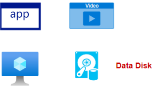
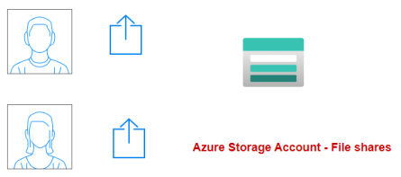
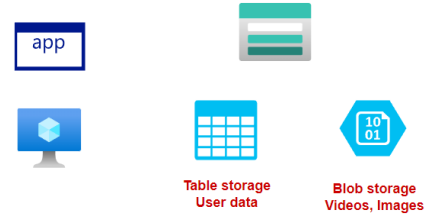
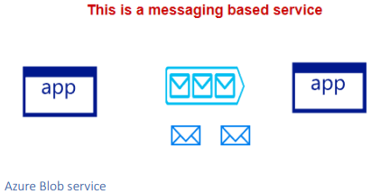

# What are Azure Storage Account
This is storage on the cloud via the use of different services

<b> Azure Blob Storage:</b> 
  * this is object storage service
  * this is great for storing unstructured data
  * can grow automatically based on demand
  * good for storing backups
  * good for storing images, videos, audio files
    * IMPORTANT: the vm and storage should be separate, if the vm crashes or fails. data is still available.
      * 

<b> Azure File Shares </b> 
  * manage storage for individual users.
    * 

<b> Azure  Table Storage </b> 
* great when you want to store non relational structured data.
* this is when your data is of schemaless design
  
  * example : storing information about files saved in blob

    * 

<b> Azure Queue Storage </b>
  * messaging based service between different applications or different components of the application. you can use this application
      * 

