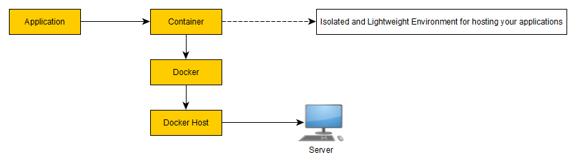

# Azure Container


## Commands to install on ubuntu
Update the package index
```bash
sudo apt-get update
```
Install packages to allow apt to use the repository over HTTPS
```bash
sudo apt-get install \
    ca-certificates \
    curl \
    gnupg \
    lsb-release
```
Add Docker's official GPG key
```bash
curl -fsSL https://download.docker.com/linux/ubuntu/gpg | sudo gpg --dearmor -o /usr/share/keyrings/docker-archive-keyring.gpg
```
Setup a stable repository
```bash
echo \
  "deb [arch=$(dpkg --print-architecture) signed-by=/usr/share/keyrings/docker-archive-keyring.gpg] https://download.docker.com/linux/ubuntu \
  $(lsb_release -cs) stable" | sudo tee /etc/apt/sources.list.d/docker.list > /dev/null
```
Update the package index
```bash
sudo apt-get update
```
Install docker, containerd
```bash
 sudo apt-get install docker-ce docker-ce-cli containerd.io
```
Launching a container
```bash
sudo docker run --name mynginx -p 80:80 -d nginx
```

## Docker command explanation
```bash
sudo docker run --name mynginx -p 80:80 -d nginx
```
* `nginx`   : docker image name
* `mynginx` : name of the container
* `80:80` : port that needs to be mapped

# Azure Container Registry
this is the place where we save our images for the organisation. this will be a private repo to save the container images.


