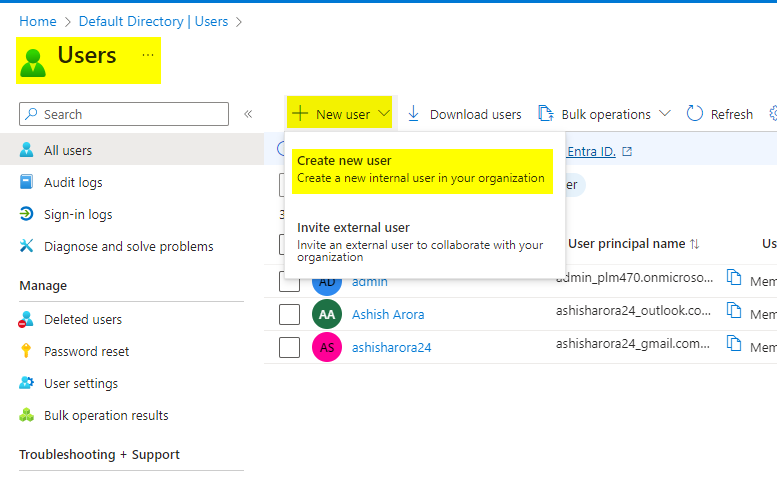
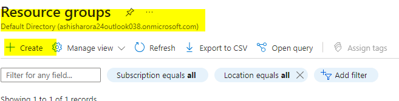
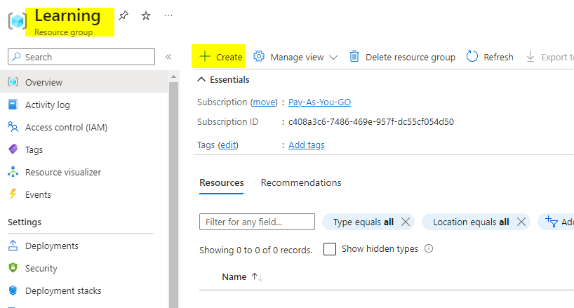
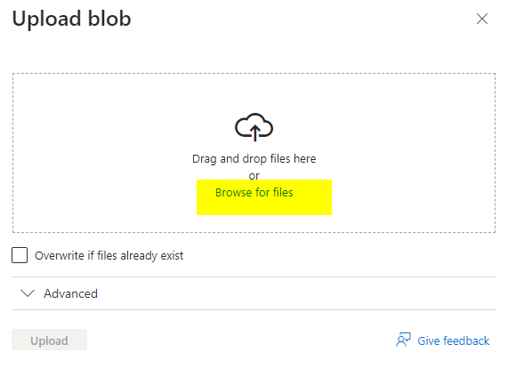
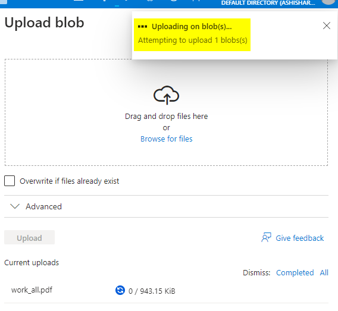
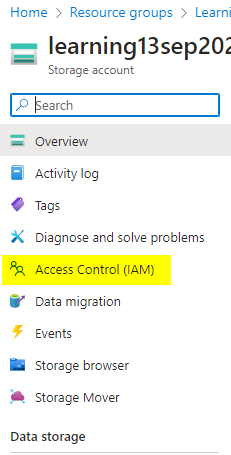
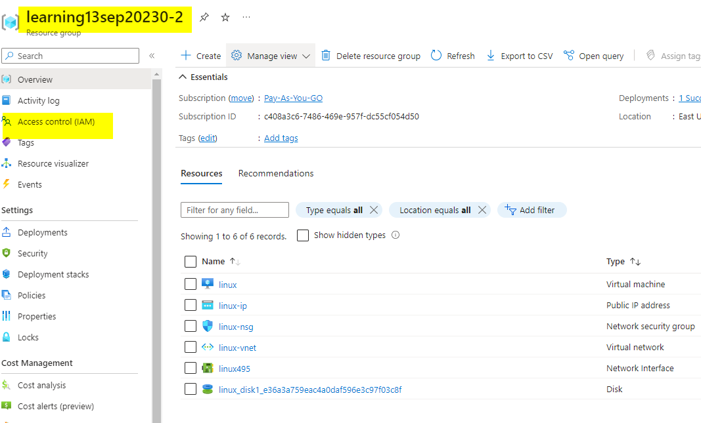
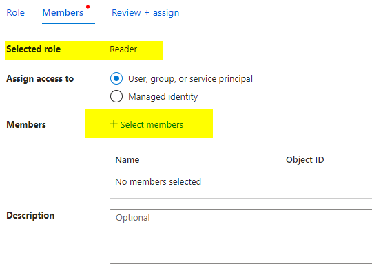
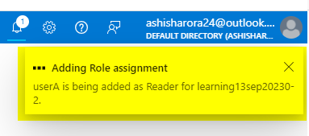
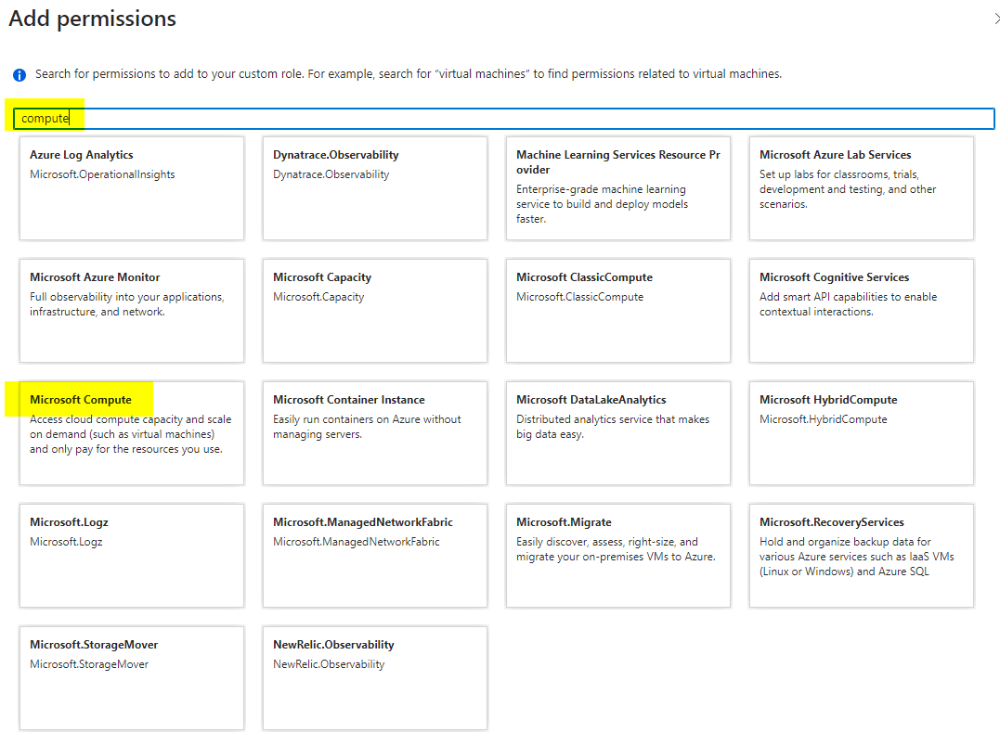

# Azure Subscription
when you create azure account you get 2 things
* Azure Subscription 
* Azure Active Directory

## Azure Subscription 
Azure Subscriptions is for billing 
    

## Azure Active Directory
* Azure Active Directory is where you handle users and their identities. 
* also the identities of your applications

## mapping between Subscription and AD 
* one Azure Subscription can only be mapped to one AD Account.
* one Azure Active Directory can be mapped to more than one Azure Subscription account
* 
* 

## how to change the directory for any subscription
* 

## create a  new user in azure active directory
* 
* 
* 
* 
* 
* 
* 
* 
* 
* 
* 
* 

## create storage account by Main User <ashish> and give Reader Access to UserA

### create Storage Account

### check if the userA have access, it should not be able to access

### grant access at storage level (reader access only)

### check if the userA have access, it should have access

## provide acces at Resource Group Level

### create a vm in Resource Group and create VM

### give Reader access to VM only

### check if user can see all components related to VM

### give Reader access at Resource Group Level

### check if user have access and  what type

## Difference
* Reader
  * only read access. cant perform actions
* Contributor
  * Read + start stop and perform action. can't provider access to others
* User Access Administrator
  * Read + start stop and perform action + can provider access to others
* Owner
  * have complete access to start, stop, create, provide access to others

## create custom role

