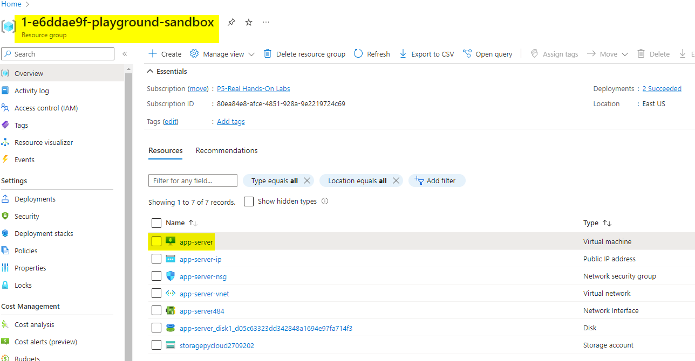
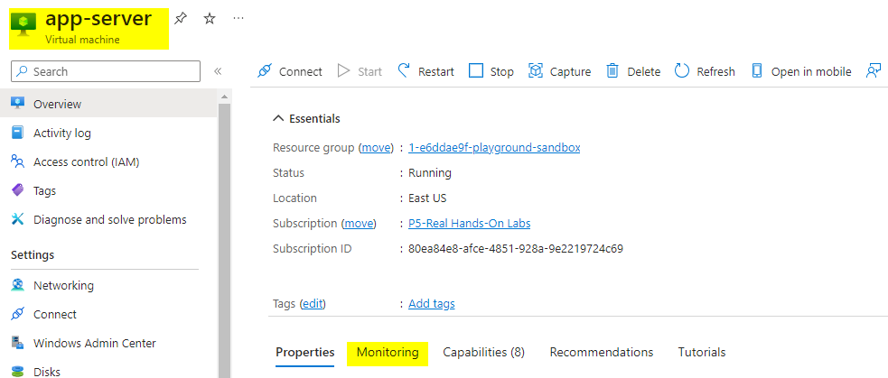
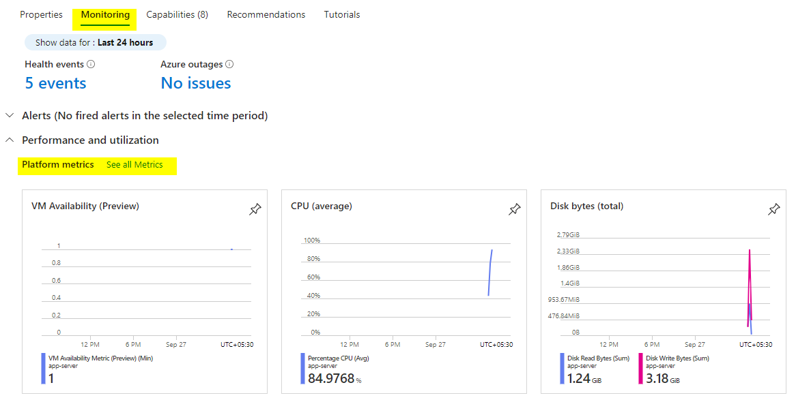
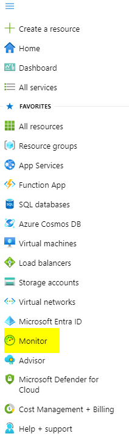
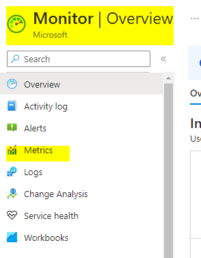
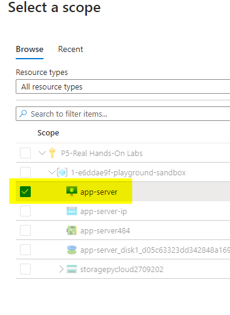
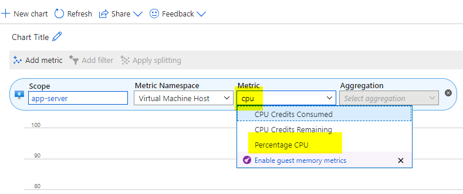
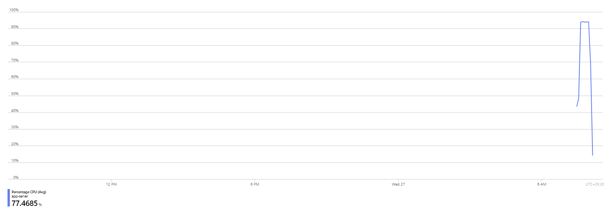

# Qucik look at azure monitoring
* create a resource group with a Vitual Machine in it
* 
* go to virtual machine and click on Monitoring
* 
* you can see metric graph under the monitoring section of the vm
* 
* these chars are coming from the monitoring module
* Open monitoring module
* 
* inside monitoring module select the metrics option
* 
* for the scope you need to select the resource on which you want to fetch the logs
* 
* select the type of metrics you what to check.
* for the current case its "percentage CPU"
* 
* you will get the metric chart
* 
