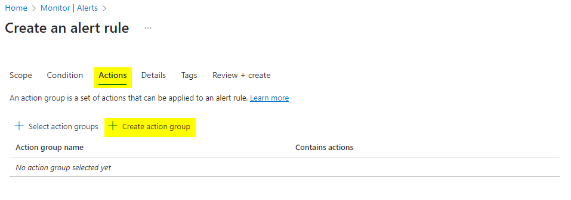

# Monitoring Alerts
* alerts are notification sent to user or group of user when something happens
* so in our case we will apply alert that when a VM's Network out total is crossed a threshold value it should send email to IT admin team

* go to resource group
* 
* open resource group
* 
* click on create to create a vm
* 
* select vm 
* 
* select vm 
* 
* enter vm details 
* 
* select the monitoring option
* 
* select the metrics option
* 
* select the alert rule option
* 
* since we are doing on the VM , select the vm name
* 

* 
* select the type of signal
* 
* 
* 
* add threshold value
* 
* create action group
* 
* 
* 
* 
* 
* 
