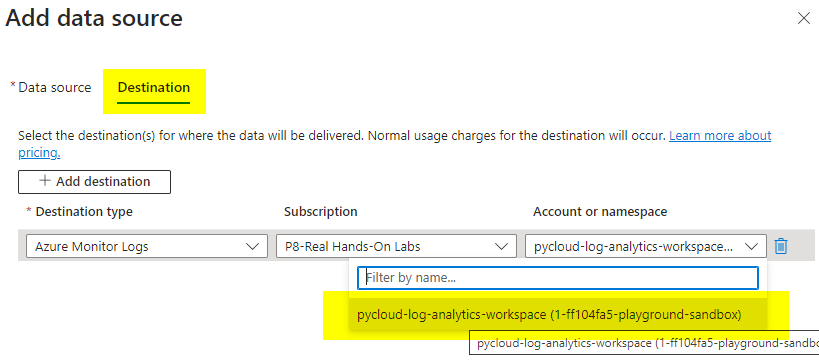

# 5_connecting_vm_to_workspace

* for connecting a vm to Log Analystic Workspace, first we need to create VM
* 
* 
* 
* 
* Go Monitor
* 
* Go to Data Collection Rule
* 
* Create a new Rule
* 
* 
* Add resources
* 
* 
* 
* Add Data Source and also map the destination which is the workspace
* 
* 
* 
* 
* 
* 
* 
* 
* 
* Once the data source collection rule is added, the extension is added on to the VM
* 
* you can now go and check the logs in the Workspace
* 
* 
* 
* 
* 

