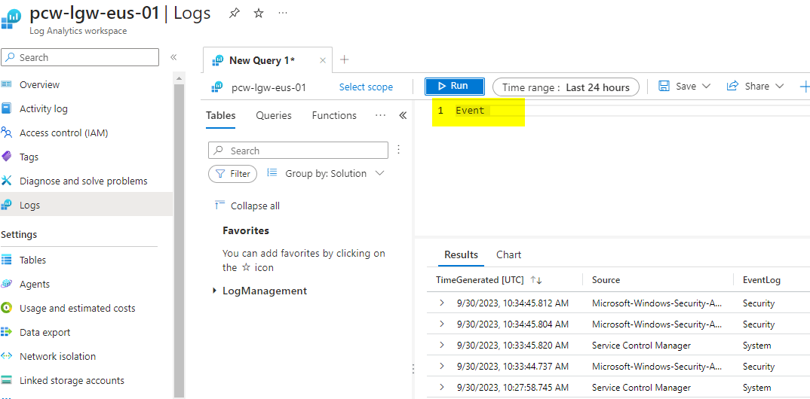
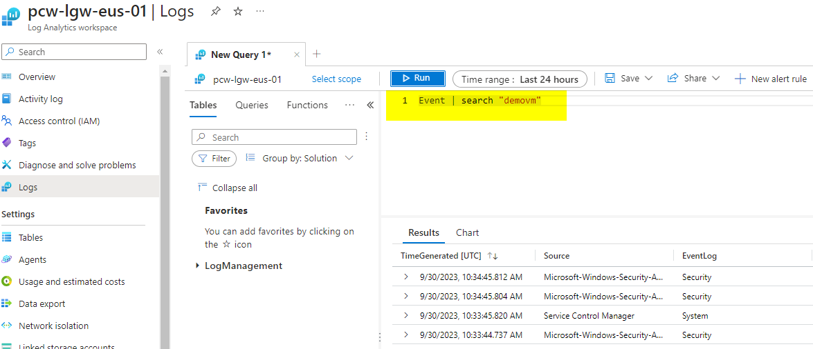
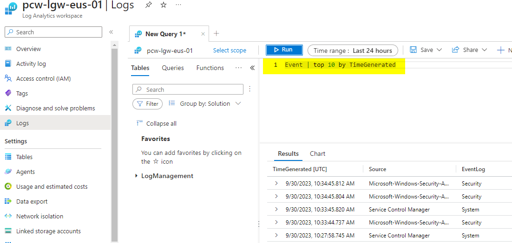
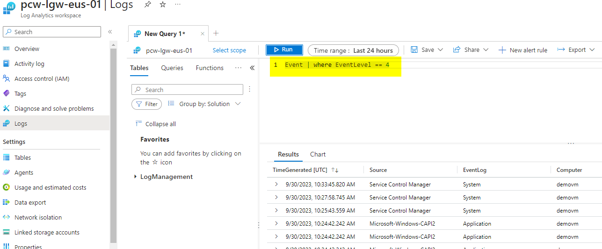
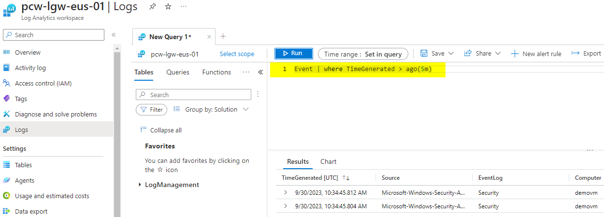
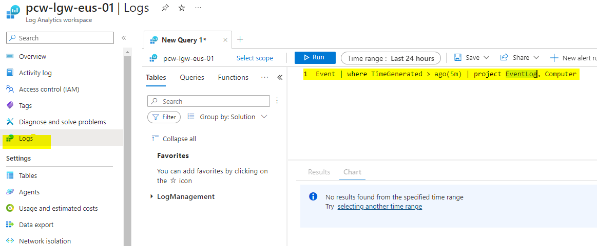
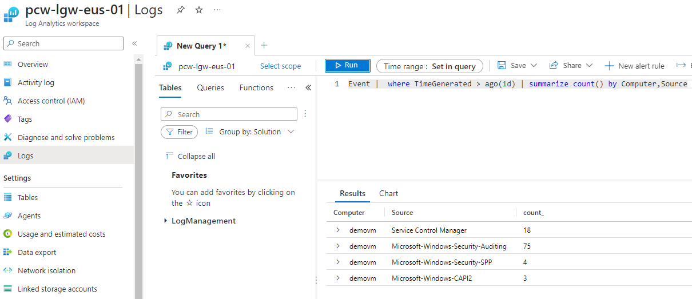
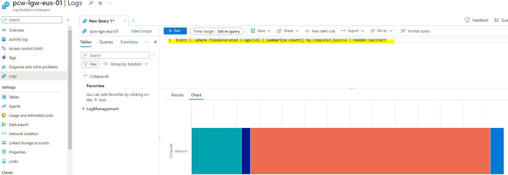
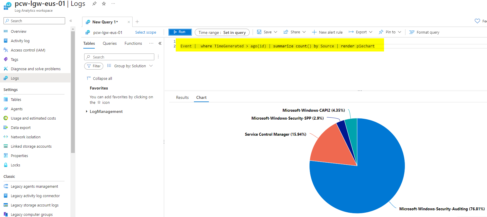

#  Log Analytics Queries
Below is a reference for the queries for Log Analytics

0. This can be used for search for a keyword in the event table

Event
* 

1. This can be used for search for a keyword in the event table

Event | search "demovm"
* 
* 
1. This can be used for search for a keyword in the event table

Event | search "demovm"
* 

2. This can used to pick up 5 events taken in no specific order

Event | top 10 by TimeGenerated
* 

3. This is used to filter based on a particular property of an event

Event | where EventLevel == 4
* 

4. This can be used to check for the events generated in the previous 5 minutes

Event | where TimeGenerated > ago(5m)
* 

5. This can be used to project certain properties

Event | where TimeGenerated > ago(5m) | project EventLog, Computer
* 

6. Here you can summarize the events

Event |  where TimeGenerated > ago(1d) | summarize count() by Computer,Source
* 

7. Here you can render a bar chart based on the data

Event |  where TimeGenerated > ago(1d) | summarize count() by Computer,Source | render barchart
* 
8Here you can render a pie chart based on the data

Event |  where TimeGenerated > ago(1d) | summarize count() by Source | render piechart 
* 