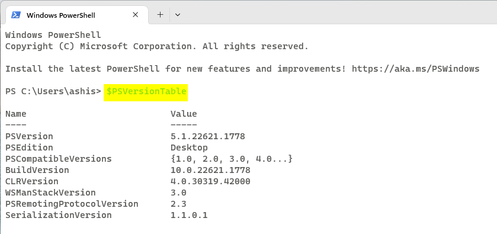
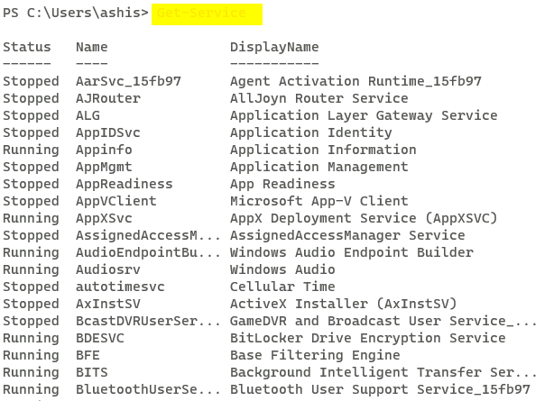
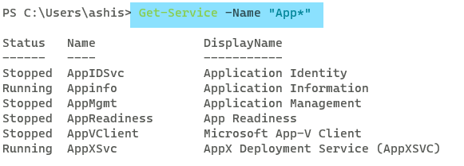
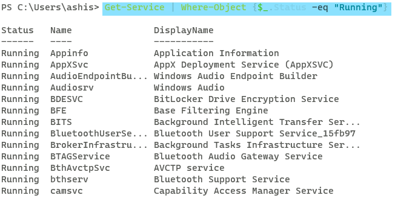

# BASIC OF POWERSHELL
* check the version  of the powershell
* 
* get the list of services running in the powershell
* 
* get the list of services with the name App*
* 
* get the list of services which are running.
* this can we done when we apply filter on the output
* output is received by $_.
* 

