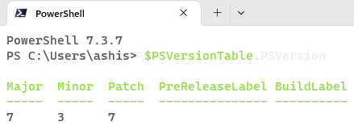
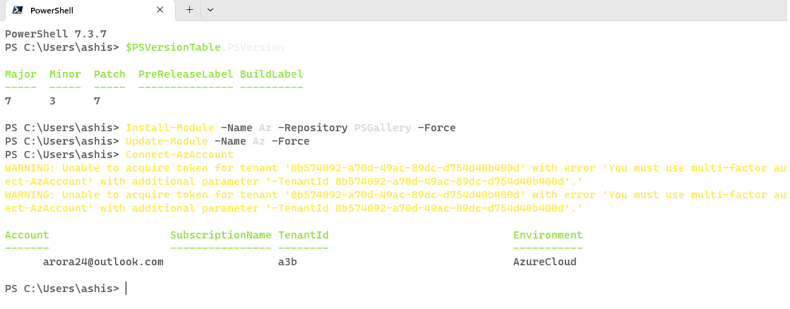
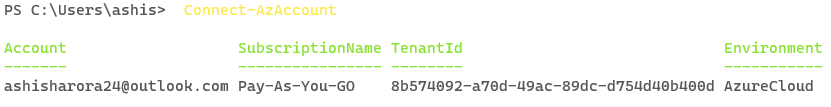

# Run Azure powershell


* first check the version of your powershell
```cmd
    $PSVersionTable.PSVersionc
```
* 


* commands to install Azure Powershell module
```cmd
    Install-Module -Name Az -Repository PSGallery -Force
    Update-Module -Name Az -Force
```

* 


### Sign in
* commands to install Azure Powershell module
```cmd
    Connect-AzAccount
```
* 


