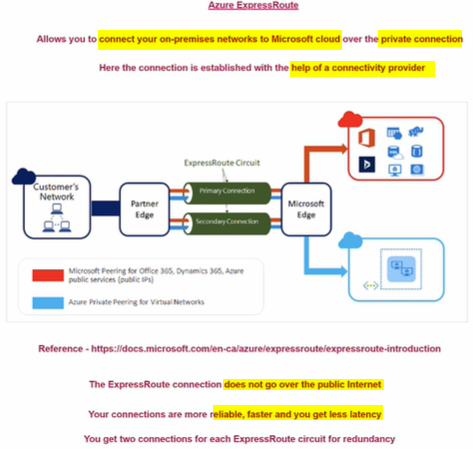
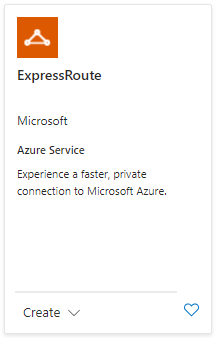
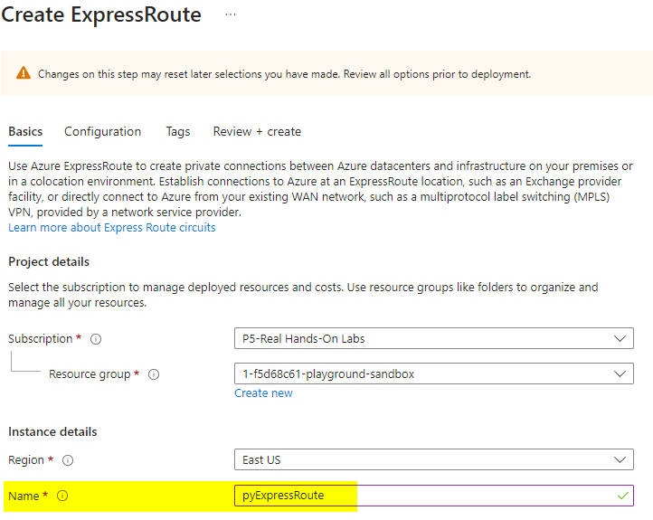
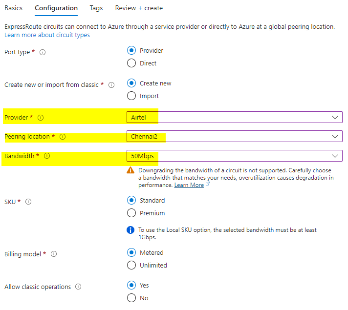

# Azure ExpressRoute

## 
what is Azure ExpressRoute
* Allows you to connect your on-premises network to Microsoft cloud over the private connection
* Established with the help of a connectivity provider
* ExpressRout connection does not go over the public internet
* connect is 
  * reliable
  * faster
  * gets less latency
* you get 2 connection for each ExpressRoute circuit

## 
Steps Installation

## 
 Incomplete. as now you need to connect with the Service provider and get the further details

