# Azure Firewall Service

## 
Features
* built-in high availability
* can deploy the azure firewall instance across two or more availability zones
* filter traffic based on filly qualified domain names
* can create network filtering rules , based on :
  * source IP
  * destination IP address
  * port
  * protocol
* stateful in nature, so it understands what packets of to allow
* built-in threat intelligence

## 
 Main concept
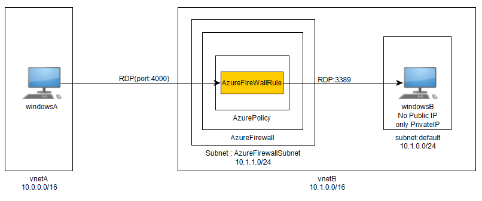
## 
 step 1: create Virtual Networks
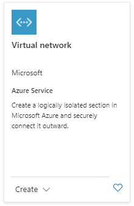
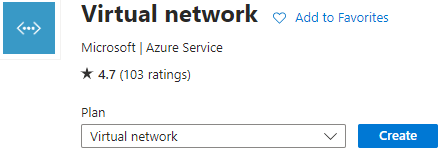
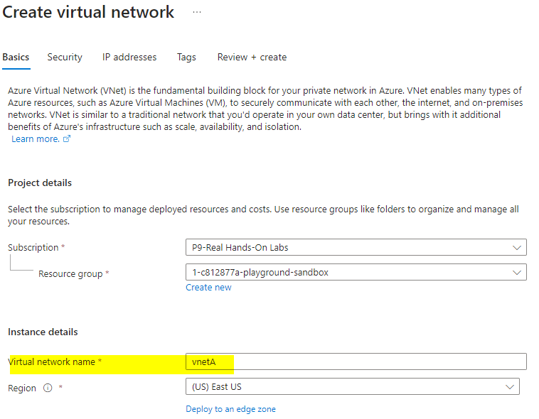
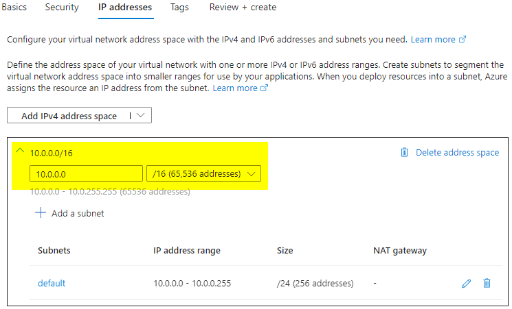
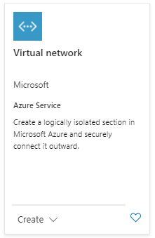
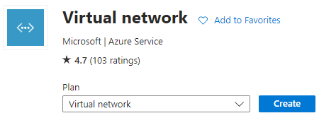
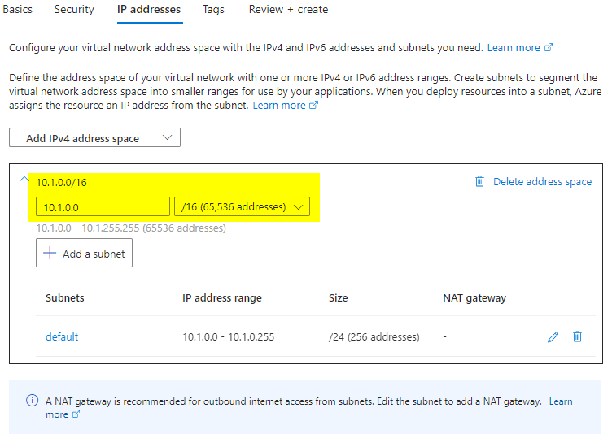
## 
 step 2: create Virtual Machines
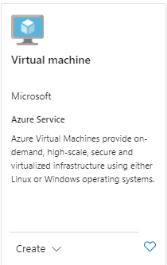
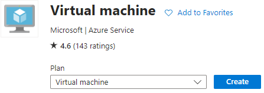
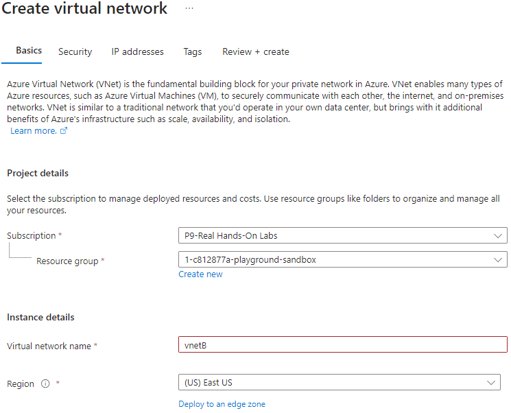
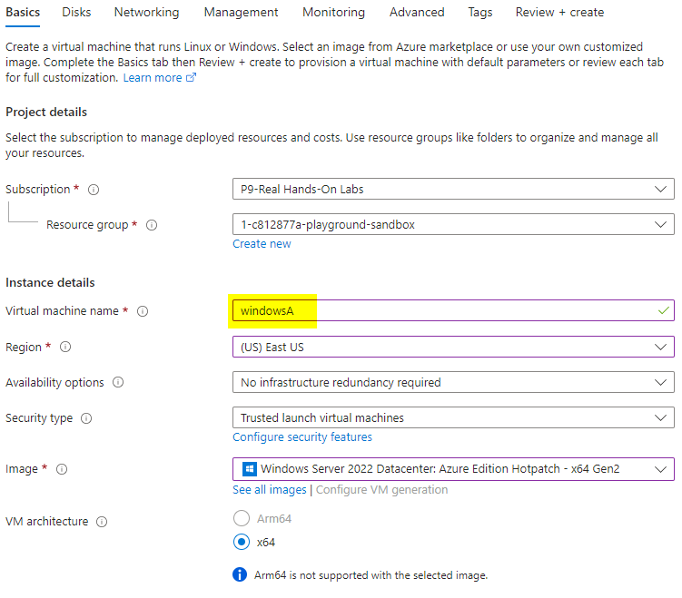
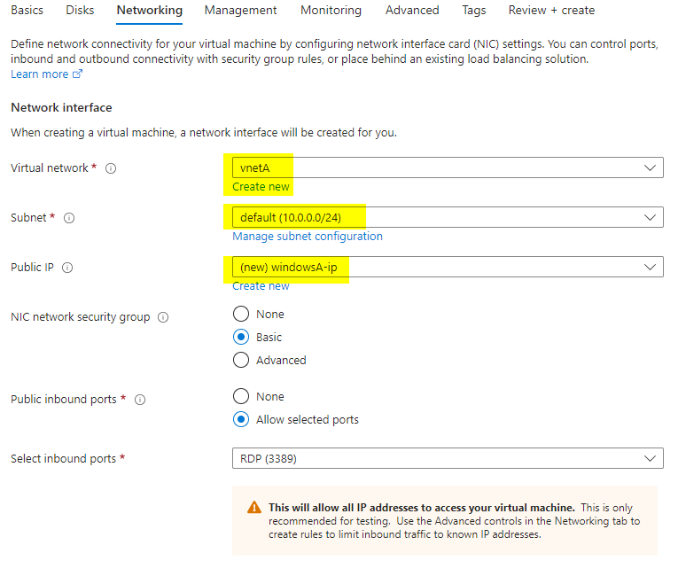
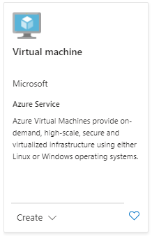
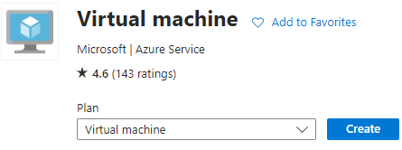
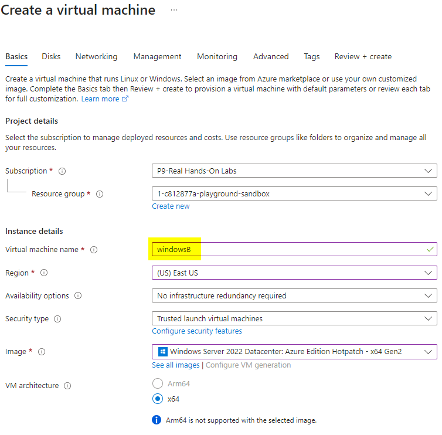
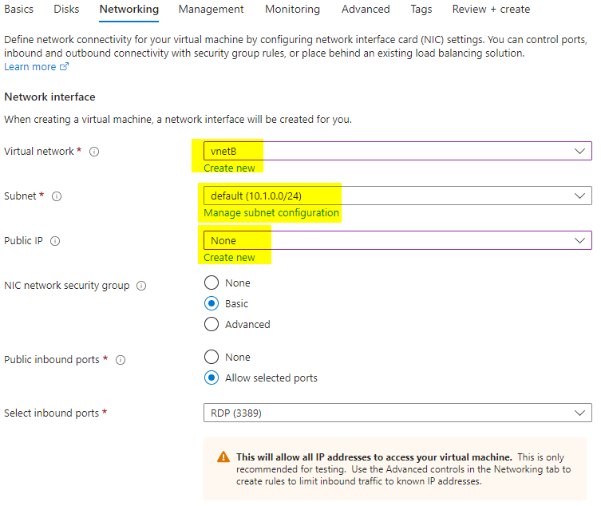
## 
 step 3: create subnet for Azure Firewall
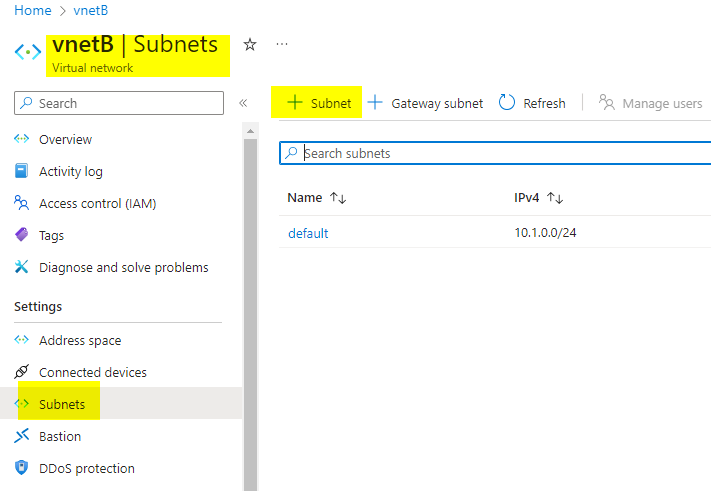
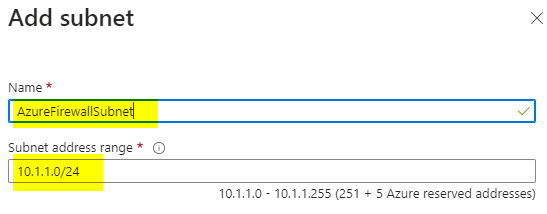
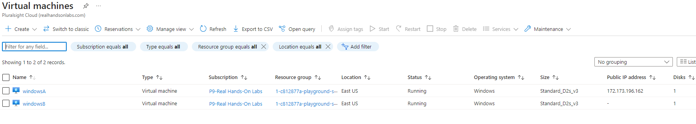
## 
 step 4: create Azure Firewall
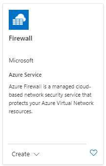
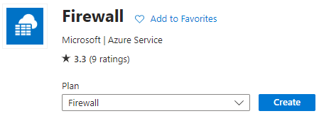
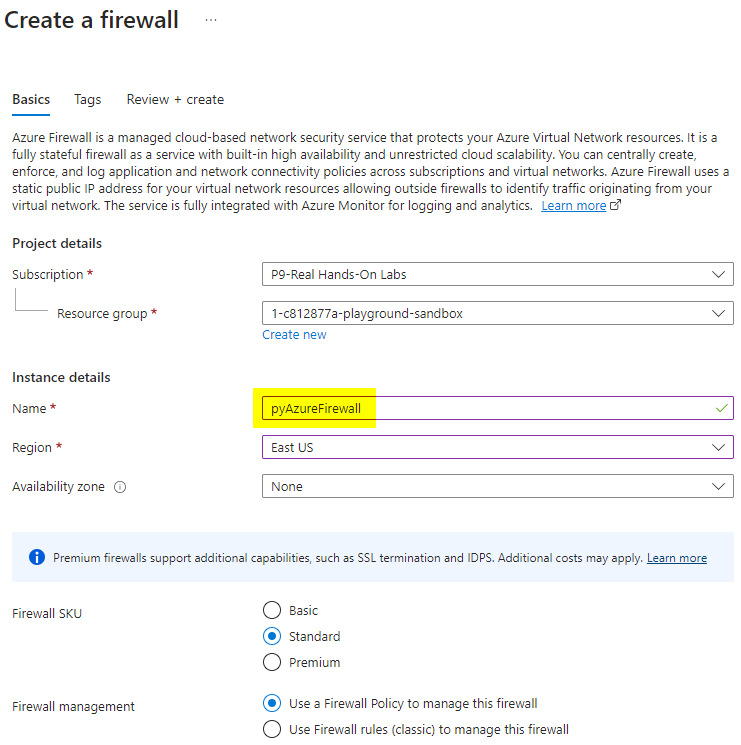
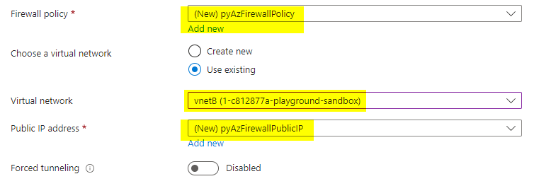
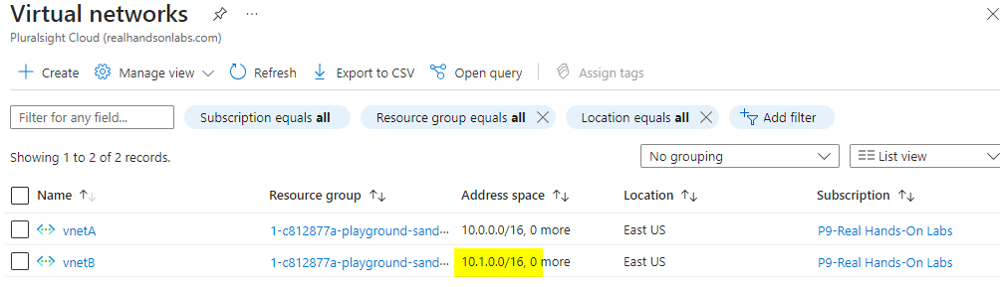
## 
 step 5: create Rule in Azure Firewall Policy 
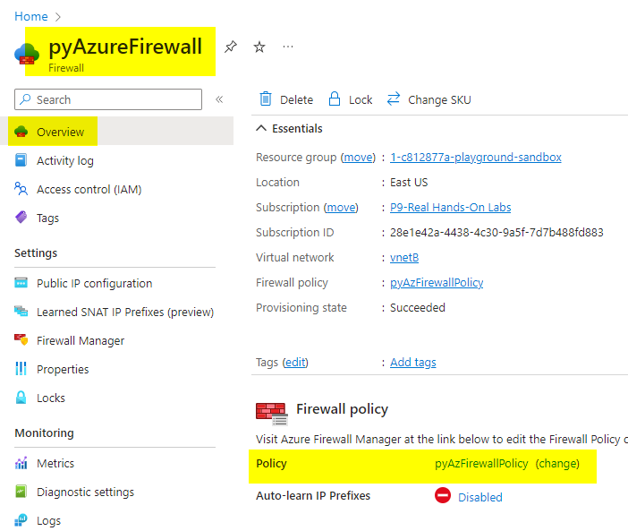
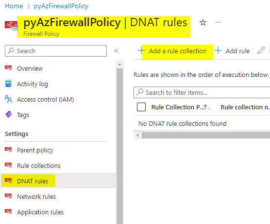
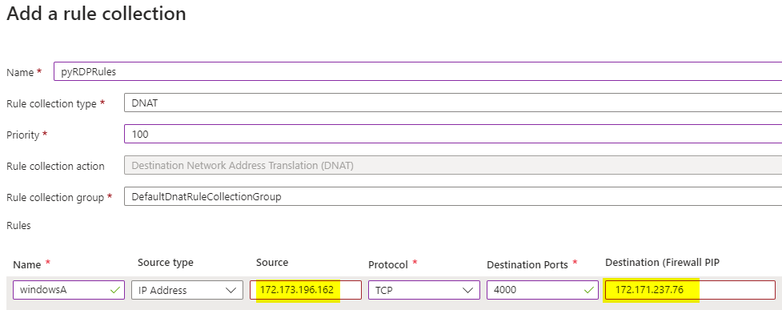
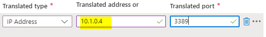
## 
 step 6: try connecting
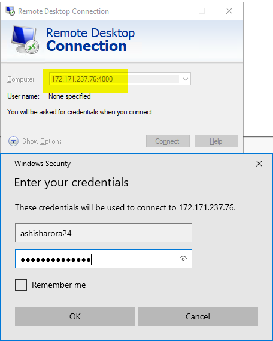
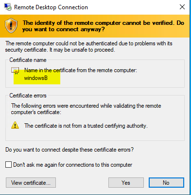
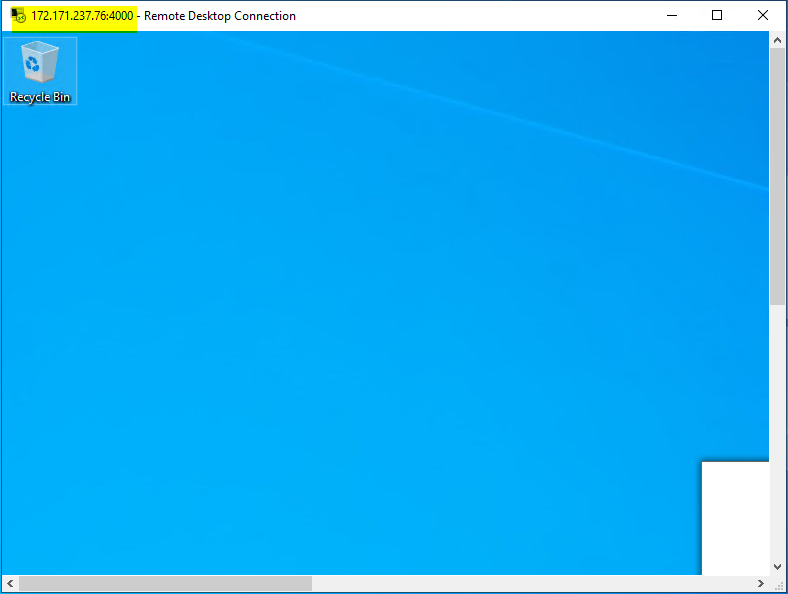
