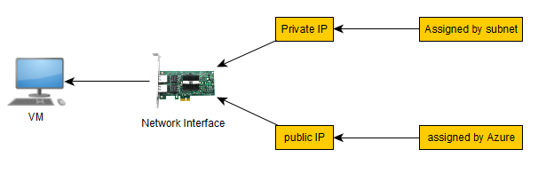
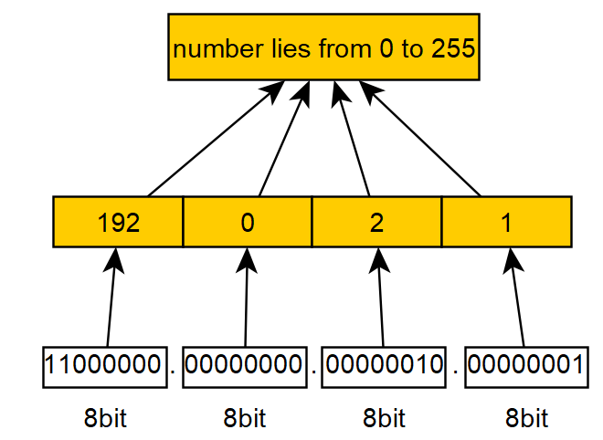
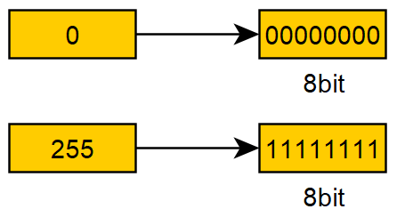
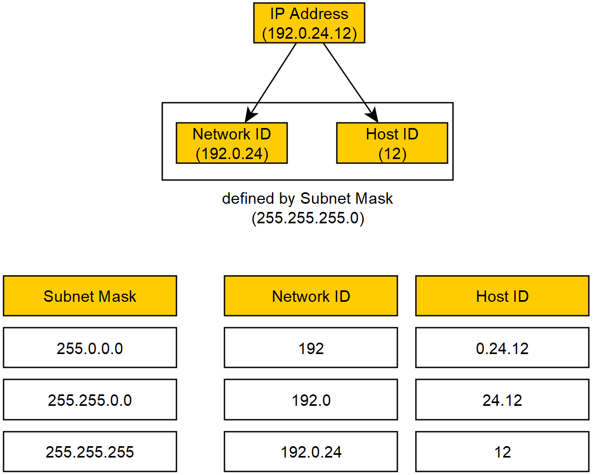
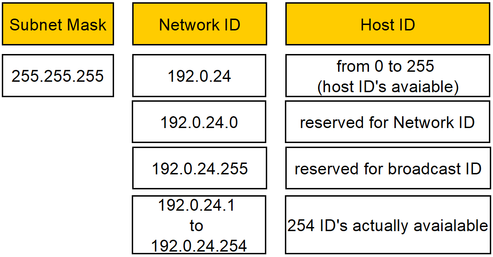
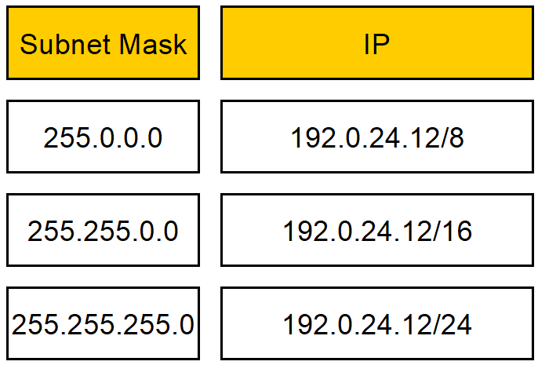
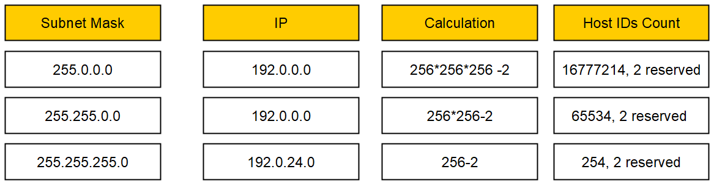
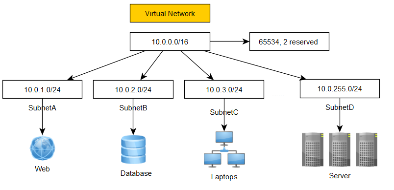
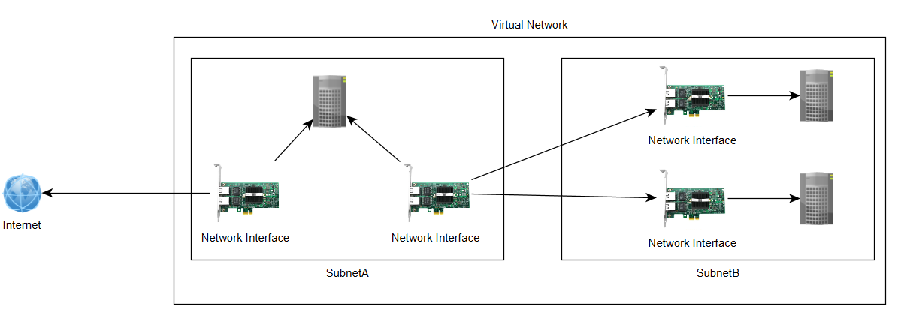

# Network Interface & CIDR Notation

## 
 CIDR fullform
* `C` - Classless
* `ID` - Inter-Domain
* `R` - Routing

## 
Network Interface

## 
IP basic concept

## 
IP basic concept

## convert IP number to 8 bit 
example:
192.0.2.0 
<pre>
`192 is less than 256 and greater than 128`
    :   256   128  64    32    16    8     4    2
    :   0     1    0     0     0     0     0    0
</pre>
`192- 128 = 64`
<pre>
    :   256   128  64    32    16    8     4    2
    :   0     1    0     0     0     0     0    0  
    :   0     1    1     0     0     0     0    0
</pre>    
so 192 is 01100000
    
## 
IP & Masking

## 
IP Number of host available

## 
IP masking shorthand

## 
IP host count

## 
IP having multiple Subnet 

## 
Multiple interface on same VM or Server 
