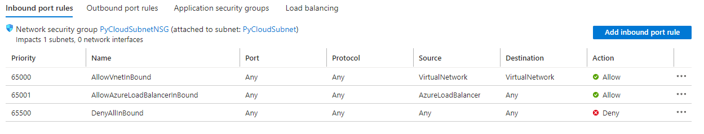
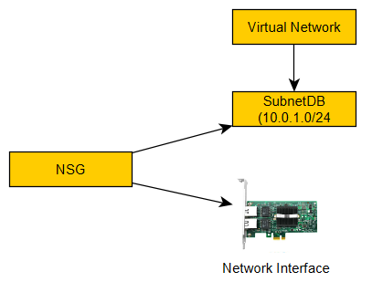
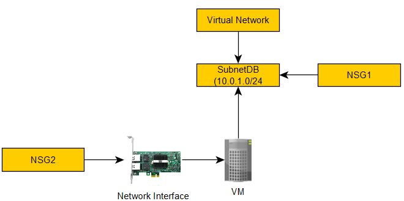
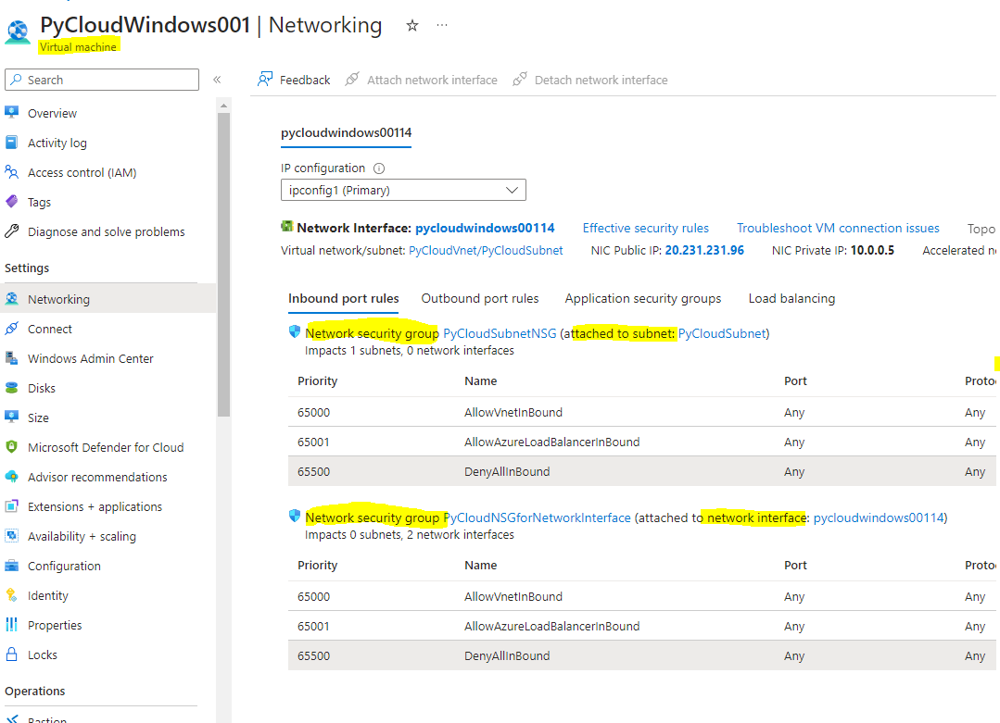
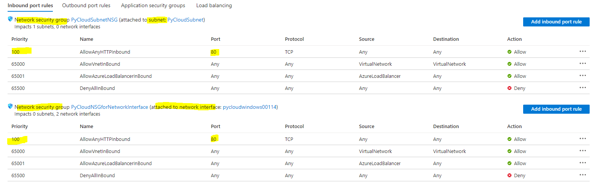
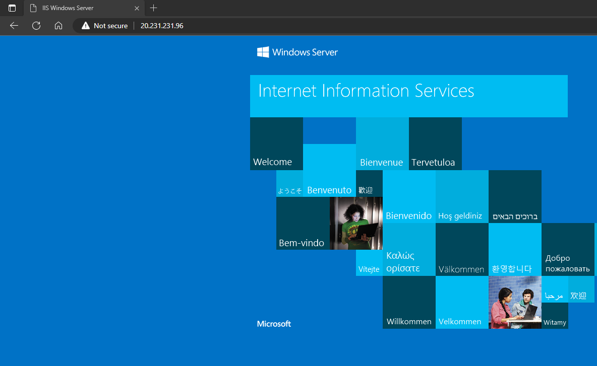

# Network Security Group

## 
What is Network Security Group
it's a firewall 
it is applied in Inbound and Outbound Rules only 
- Inbound port rules 
- Outbound port rules 

## 
Where can NSG be attached

which can be attached to 
- Subnet 
- Network Interface 

## 
Where can NSG be attached

which can be attached to 
- Subnet 
- Network Interface 

## 
EXAMPLE

which can be attached to 
- Subnet 
- Network Interface 

