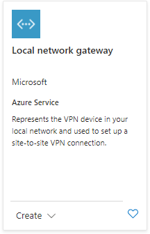
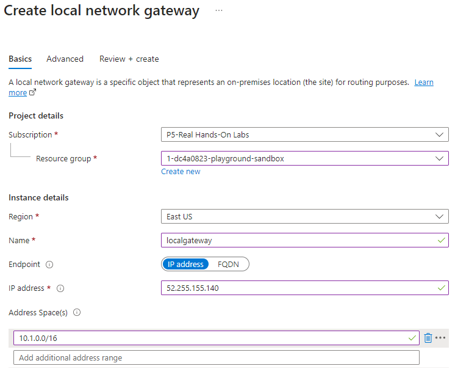
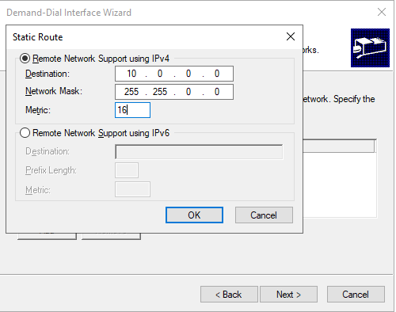
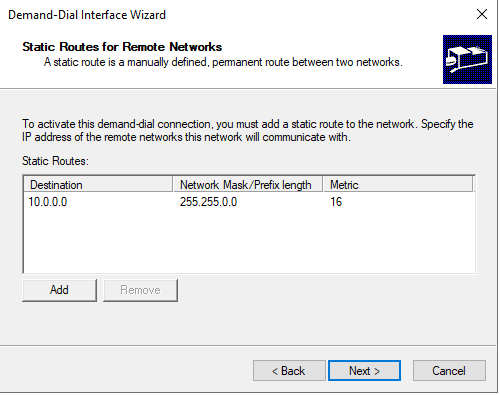

# Site to Site Configuration
- a secure connection between an on-premise network and an Azure network via the Internet.

- On the on-premise side, you need to have a VPN device that can route traffic via the Internet onto the VPN gateway in Azure. 
  - The VPN device can be a hardware device like a Cisco router or a software device ( e.g Windows Server 2016 running Routing and Remote services). 
  - The VPN device needs to have a publically routable IP address.

- The subnets in your on-premise network must not overlap with the subnets in your Azure virtual network

- The Site-to-Site VPN connection uses an IPSec tunnel to encrypt the traffic.

- The VPN gateway resource you create in Azure is used to route encrypted traffic between your on-premise data center and your Azure virtual network.

- There are different SKU's for the Azure VPN gateway service. Each SKU has a different pricing and attributes associated with it 

## 
Virtual Network can have many Address Space and Subnets

### 

high level

## 

lets start the installation

## 
step 1 : make the azure main_office_vnet, ip range as 10.0.0.0/16 and add create a vm 

## 
step 2: create a GatewaySubnet

## 
step 3: create VM with no public IP in the main_office_vnet and in subnetA

## 
step 4 : create VPN Gateway to main_office_vnet to GatewaySubnet

## 
step 5: create on_premise_vnet with IP range 10.1.0.0/16 

## 
step 6: create 1 VM's. one for client machine and other as Routing VM

## 
step 7 : enable the Routing Service on the windows machine

## 
step 8: create Local Network Gateway in the main_office_network and give it details from the on_premise_vnet 

## 
step 10:  create a new connection in the VPN Gateway and connect the VPN with the local Network gateway

## 
step 11: on routermachice you need to tell the main_office_vnet vpn details to Demand-dial Interface.

## 
Completed. Connect to machine

### 
step 13: lets add another vnt network and add a vm 

### 
step 14: add vnet peering between main to on-premise2

### 
step 15: add the details of the new vnet to static Routes in the RoutingServer

