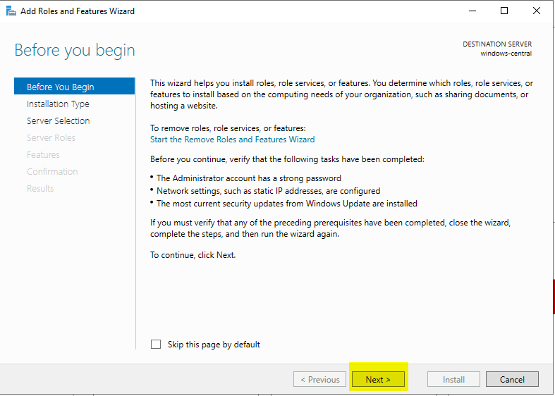
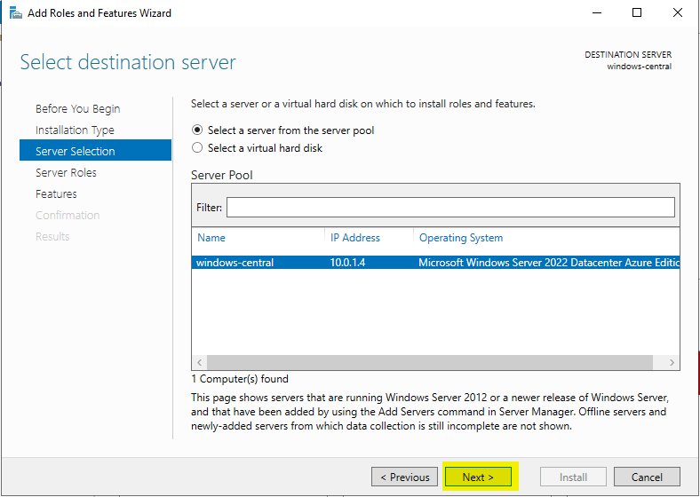
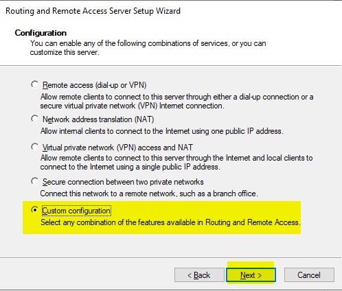

# User Defined Routes

## 
Virtual WAN
### 
 Step 1: Create Virtual Network with 3 subnets 

### 
 Step 2: Create VM's in each Subnet
* subnetA and SubnetB virtual machines should not have the public IP Address

### 
 Step 3: Create Route Table in Azure.

* Route all the traffic of the Virtual Network to the windowsCentral

### 
 Step 4: Associate the Route Table to the subnet
* Associate the Route Table to the subnetA and SubnetB
* now any traffic starting from SubnetA and SubnetB will first go the windowsCentral

# Step 5: Enable IP Forwarding at azure level

### 
 Step 6: Login to WindowsCentral and enable Windows Routing at OS level

