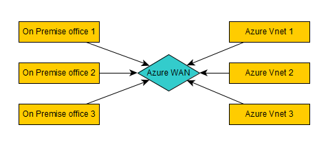
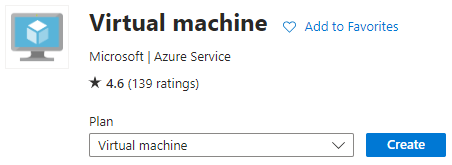
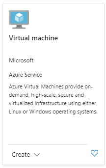
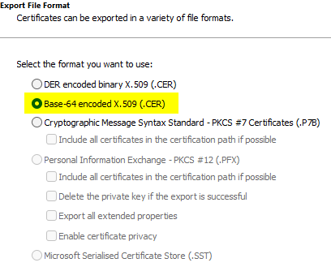
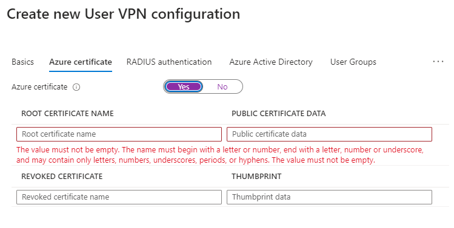
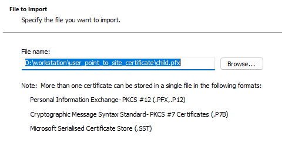
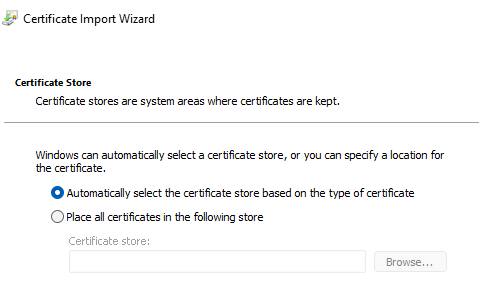
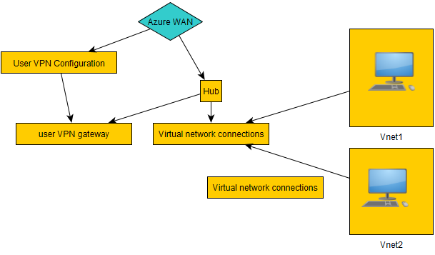
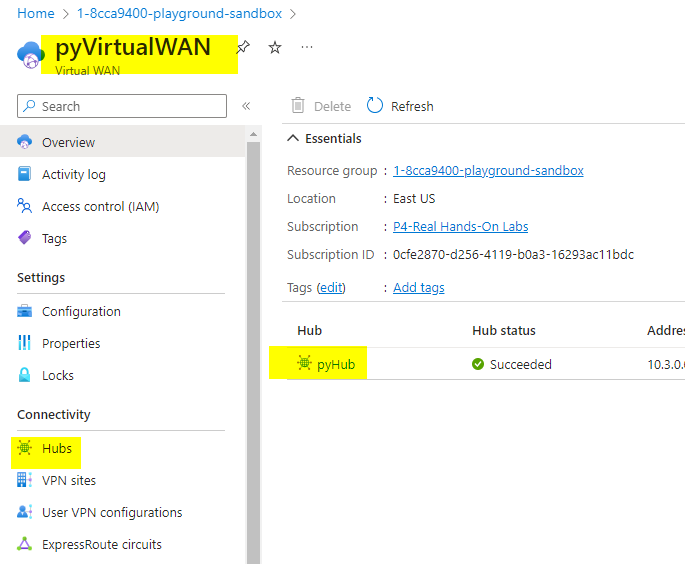

# Virtual WAN

## 
Virtual WAN

## 
Steps to install
* install virtual WAN
* create the Hub inside VirtualWAN
* map it with the VNets and on- premise

## 
 Types of VirtualWAN
* There are 2 types of VirtualWAN
  * Standard 
  * Basic

  
### 
 Step 1: lets create 2 VNet's and one one VM in it
* the public IP would be off in both the cases
1. VNET: <vnet1>
   * VM : <windows11> 
   * IP range : <10.1.0.0/16>
2. VNET: <vnet2>
   * VM : <windows22> 
   * IP range : <10.2.0.0/16>

### 
 Step 2: create VirtualWAN
* Name : pyVirtualWAN
* Type: Standard

 
### 
 Step 3 : create HUB
* Name : pyHub
* Hub private address space : <10.3.0.0/16>
  * is The hub's address range in CIDR notation.
  * its like a VNET so we need to provide an IP range for it, which has to be unique
* Virtual Hub Capacity : 
  * means how many VMS in total the hub can handle
* Hub Routing Prference:
  * its VPN or
  * ExpressRoute

### 
 step 4 : create Virtual Network Connection
* Name : PyWAN-VNET1
* Name : PyWAN-VNET2

### 
 step 5 : User VPN Configuration
* first create root and child Certificate
* generate certificate : https://learn.microsoft.com/en-us/azure/vpn-gateway/vpn-gateway-certificates-point-to-site

### 
 Step 6 : User VPN configuration will only work once we have Gateway created
* go to Virtual WAN => Hub => User VPN (Point to Site) => Create User VPN Gateway
* you need to mention client address pool : <172.16.0.0/16>

### 
 step 7 : Download virtual WAN user VPN profile

###
 completed
