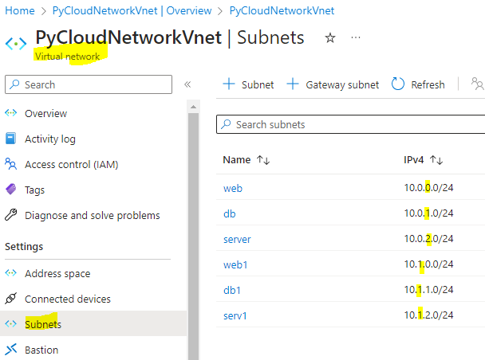
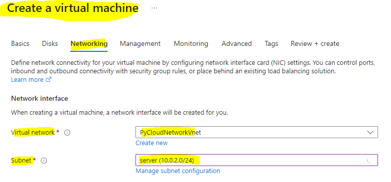
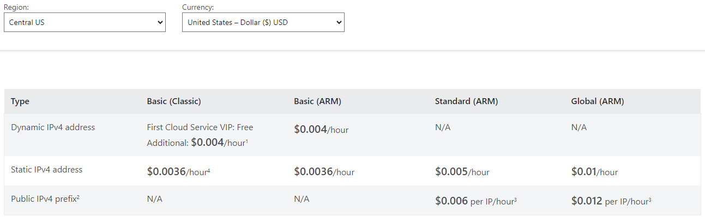
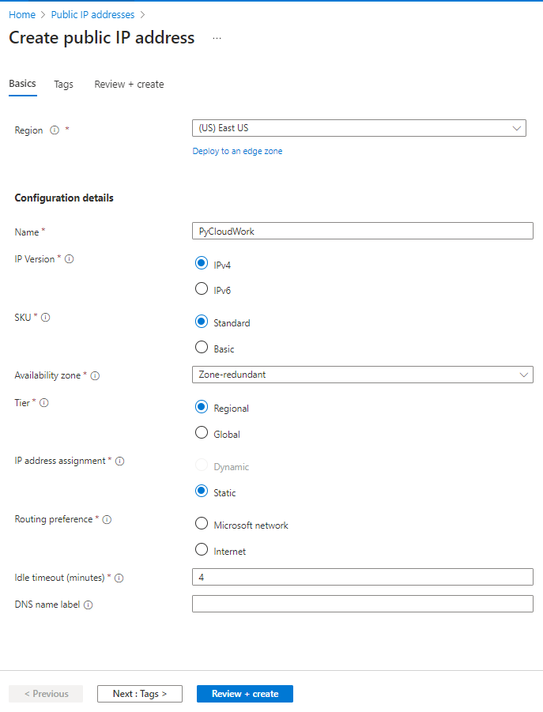
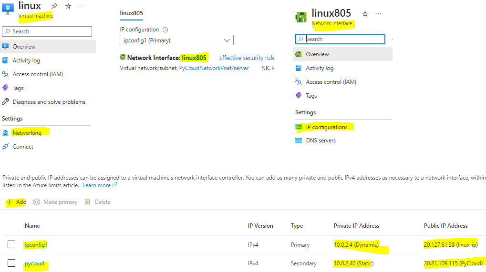
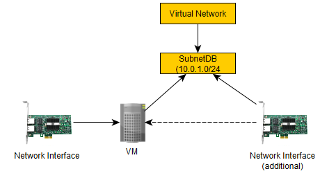
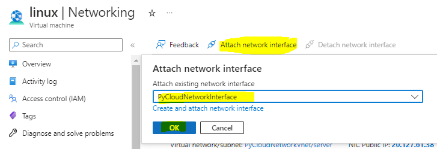
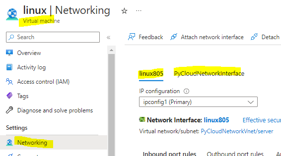

# Virtual Network

## 
Virtual Network can have many Address Space and Subnets

 

 

 

## 
Cost of IP Addresses
https://azure.microsoft.com/en-us/pricing/details/ip-addresses/

## 
Create public IP address

## 
 attaching the public IP address to the VM
- ip address cannot be directly attached to VM.
- its attached it Network interface which is attached to VM

- 
- steps

## 
Attaching addition Network Interface to the VM
- first you need to create new Network Interface.
-  you need to create this Network Interface in the same Virtual Network and Subnet where the VM exist.
- then you need to stop the VM. else it won't allow the attaching of the Network Interface

