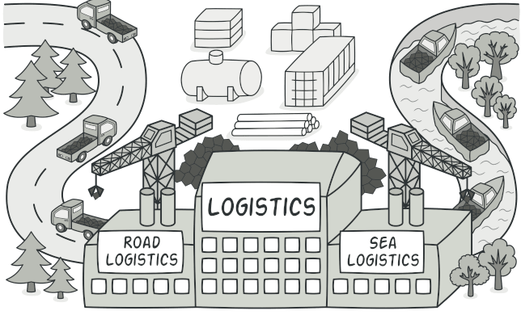

f# Factory Method


## CODE

```python
from __future__ import annotations
from abc import ABC, abstractmethod


class Transport(ABC):

    @abstractmethod
    def cost(self) -> str:
        pass

class RailTransport(Transport):

    def cost(self) -> str:
        return "Rail Transport cost Rs 1000"


class AirTransport(Transport):
    def cost(self) -> str:
        return "Air Transport cost Rs 4000"

class SeaTransport(Transport):
    def cost(self) -> str:
        return "Sea Transport cost Rs 200"

class TransportFactory():
   def create(self, typ):
      targetclass = typ.capitalize()
      return globals()[targetclass]()
   
if __name__ == "__main__":
    transport_factory = TransportFactory()
    transports = ['airtransport', 'railtransport', 'seatransport']
    for transport in transports:
        transport_obj = transport_factory.create(transport)
        if hasattr(transport_obj, "cost"):
           print(transport_obj.cost())
```


 Output.txt: Execution result
```bash
Air Transport cost Rs 4000
Rail Transport cost Rs 1000
Sea Transport cost Rs 200
```