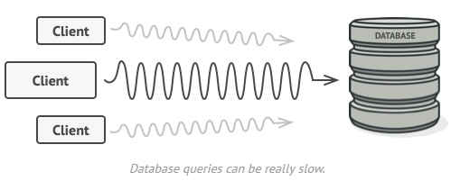
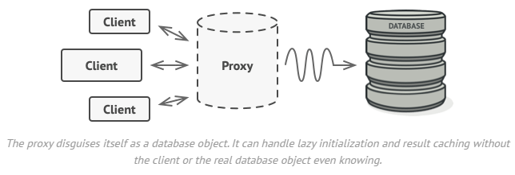

# Proxy


## Problem
Why would you want to control access to an object? Here is an example: you have a massive object that consumes a vast amount of system resources. You need it from time to time, but not always.



You could implement lazy initialization: create this object only when it’s actually needed. All of the object’s clients would need to execute some deferred initialization code. Unfortunately, this would probably cause a lot of code duplication.


## Solution
The Proxy pattern suggests that you create a new proxy class with the same interface as an original service object. Then you update your app so that it passes the proxy object to all of the original object’s clients. Upon receiving a request from a client, the proxy creates a real service object and delegates all the work to it.




But what’s the benefit? If you need to execute something either before or after the primary logic of the class, the proxy lets you do this without changing that class. Since the proxy implements the same interface as the original class, it can be passed to any client that expects a real service object.

## CODE
```python
from abc import ABC, abstractmethod


class Subject(ABC):
    @abstractmethod
    def request(self) -> None:
        pass


class RealSubject(Subject):

    def request(self) -> None:
        print("RealSubject: Handling request.")


class Proxy(Subject):
    def __init__(self, real_subject: RealSubject) -> None:
        self._real_subject = real_subject

    def request(self) -> None:
        if self.check_access():
            self._real_subject.request()
            self.log_access()

    def check_access(self) -> bool:
        print("Proxy: Checking access prior to firing a real request.")
        return True

    def log_access(self) -> None:
        print("Proxy: Logging the time of request.", end="")


def client_code(subject: Subject) -> None:
    subject.request()


if __name__ == "__main__":
    print("Client: Executing the client code with a real subject:")
    real_subject = RealSubject()
    client_code(real_subject)

    print("")

    print("Client: Executing the same client code with a proxy:")
    proxy = Proxy(real_subject)
    client_code(proxy)
``` 

 Output.txt: Execution result
```bash
Client: Executing the client code with a real subject:
RealSubject: Handling request.

Client: Executing the same client code with a proxy:
Proxy: Checking access prior to firing a real request.
RealSubject: Handling request.
Proxy: Logging the time of request.
```
